# Portal

Profile manager for Claude Code. Save, switch, and diff `~/.claude/` configurations. The swap is one `rename(2)` syscall, so the directory is never half-written. Every load makes a backup first.

```bash
portal save work-redteam       # snapshot current .claude/ as a profile
portal load personal-webdev    # atomic swap to a different config
portal toggle                  # bounce back to the previously active profile
portal diff work-redteam personal-webdev   # compare two profiles
portal clone work-redteam fresh --only skills,rules --fresh-claude-md
portal export work-redteam     # portable archive for sharing
portal undo                    # restore from automatic backup
portal                         # launch the TUI
```


## Why

Claude Code stores prompts, settings, skills, memory, hooks, plugins, agents, and slash commands under `~/.claude/`. If you keep more than one configuration around (red-team, web-dev, research, personal), switching means moving files around by hand. One bad edit to `settings.json` and there is no undo.

Portal stores each configuration as a named profile and treats the active `~/.claude/` like a save game. Loading another profile is a single rename, with a `tar.zst` backup taken first.

## Install

### Pre-built binaries

Linux and macOS, both architectures. Each binary includes the TUI.

```bash
# Linux (amd64)
curl -fsSL https://github.com/caretak3r/portal/releases/latest/download/portal-linux-amd64.tar.gz | tar xz
sudo mv portal-linux-amd64 /usr/local/bin/portal

# Linux (arm64)
curl -fsSL https://github.com/caretak3r/portal/releases/latest/download/portal-linux-arm64.tar.gz | tar xz
sudo mv portal-linux-arm64 /usr/local/bin/portal

# macOS (Apple Silicon)
curl -fsSL https://github.com/caretak3r/portal/releases/latest/download/portal-darwin-arm64.tar.gz | tar xz
sudo mv portal-darwin-arm64 /usr/local/bin/portal

# macOS (Intel)
curl -fsSL https://github.com/caretak3r/portal/releases/latest/download/portal-darwin-amd64.tar.gz | tar xz
sudo mv portal-darwin-amd64 /usr/local/bin/portal
```

### From source

```bash
cargo install --path .                            # CLI + TUI (default)
cargo install --path . --no-default-features      # lean CLI, no TUI deps
```

Requires Rust 1.85+.

## What Gets Tracked

| Category | Files |
|----------|-------|
| System prompt | `CLAUDE.md` |
| Settings | `settings.json`, `.claude/settings*` |
| Skills | `skills/` |
| Rules | `rules/` |
| Memory | `memory/` |
| Commands | `commands/` |
| Agents | `agents/` |
| Hooks | `hooks/` |
| Plugins | Recorded as a blueprint, reinstalled from source on load |

### Skipped by default

- `sessions/`, `todos/`, `telemetry/`, `statsig/`
- `history.jsonl`, `cost_tracker.json`, `crash_reports/`
- `.git/`, `node_modules/`, `__pycache__/`, `.venv/` at any depth

Plugin code is not copied into profiles. Portal records which plugins are installed and where they came from (marketplace, GitHub, local path), then reinstalls them after loading.

## Commands

### `portal save [NAME]`

Snapshot the current `~/.claude/` as a named profile. Without `NAME`, overwrites the active profile (save-game behaviour). Interactive mode prompts for name, description, and tags. If a profile already exists and is not the active one, you get Overwrite, Merge, or Cancel.

```bash
portal save work-redteam -d "Offensive security workflows" -t security,work
portal save                   # interactive, or overwrite active if non-interactive + --force
portal save existing --force  # overwrite without prompting
portal save trial --dry-run   # show what would be saved
```

### `portal load <NAME>`

Replace `~/.claude/` with the named profile via atomic swap. A `tar.zst` backup is taken first. After the swap, plugins are reinstalled from the blueprint — only the *delta* against the previously active profile, so toggling between similar configs is a near-no-op.

```bash
portal load personal-webdev
portal load untested --no-backup --force   # skip backup (requires --force)
portal load minimal --no-plugins           # skip plugin reinstall
```

### `portal toggle`

Swap to the previously active profile. Portal records the outgoing profile on every successful load, so this is a one-shot way to bounce between two configs without typing names.

```bash
portal toggle                  # → load whatever was active before
portal toggle --no-plugins     # honors the same flags as `load`
```

If no previous profile is recorded yet (you've only loaded one in this session), the command exits with a helpful error.

### `portal list`

List saved profiles with file counts, sizes, and active status.

### `portal show <NAME>`

Print a profile's manifest: description, tags, dates, load count, tracked files with sizes and checksums, and installed plugins.

### `portal diff <A> [B]`

Compare two profiles. If `B` is omitted, compares against the skeleton.

```bash
portal diff work-redteam personal-webdev
portal diff work-redteam personal-webdev --file CLAUDE.md   # unified text diff
portal diff work-redteam                                    # vs skeleton
```


### `portal clone <SOURCE> <TARGET>`

Fork a profile selectively. Pick categories to keep or drop. Useful for forking a config but throwing away the memory or starting with a blank `CLAUDE.md`.

```bash
portal clone work-redteam new-webdev --only skills,rules
portal clone work-redteam minimal --without memory,hooks,plugins
portal clone work-redteam fresh --only skills --fresh-claude-md
portal clone work-redteam fork -d "Experimental fork"
```

**Categories:** `claude-md`, `settings`, `skills`, `rules`, `memory`, `commands`, `agents`, `hooks`, `plugins`

| Flag | Effect |
|------|--------|
| `--only <cats>` | Include only these categories |
| `--without <cats>` | Include everything except these |
| `--fresh-claude-md` | Write an empty `CLAUDE.md` instead of copying source |
| `-d <text>` | Description for the new profile |

`--fresh-claude-md` and including `claude-md` in `--only` are mutually exclusive.

### `portal rm <NAME>`

Delete a profile permanently.

### `portal rename <OLD> <NEW>`

Rename a profile. Updates the state file if the renamed profile is active.

### `portal reset`

Replace `~/.claude/` with a clean skeleton: default `settings.json`, empty `CLAUDE.md`, and the required directory structure. Backup taken first.

### `portal undo`

Restore `~/.claude/` from the most recent backup. Every `load` and `reset` writes a timestamped `tar.zst` archive.

### `portal status`

Show the active profile, run SHA-256 integrity checks against the manifest, and report plugin health.

### `portal verify [NAME]`

Compare stored SHA-256 checksums against actual file contents. Defaults to the active profile.

```bash
portal verify
portal verify work-redteam
portal verify --fix-plugins    # also reinstall any missing plugins
```

### `portal export <NAME>`

Pack a profile into a portable `.tar.zst` with a `portal-profile/<name>/` prefix.

```bash
portal export work-redteam                    # creates work-redteam.portal.tar.zst
portal export work-redteam -o ~/Desktop/      # custom output directory
portal export work-redteam -o custom.tar.zst  # custom filename
```

### `portal import <PATH>`

Import a profile from a `.tar.zst` archive. Validates the prefix and manifest before extracting.

```bash
portal import work-redteam.portal.tar.zst
portal import ~/Downloads/colleague-config.portal.tar.zst
```

### `portal recover`

If a previous swap crashed and left a `.claude.portal-old` directory behind, this command lets you keep the current state, roll back to the old state, or cancel.

### `portal use [NAME]` — isolated sessions

Launch a `claude` session bound to a profile's **own** config directory instead of swapping `~/.claude`. Portal materializes the profile into a private dir under `~/.config/portal/live/<name>/` and launches `claude` with `CLAUDE_CONFIG_DIR` pointed at it (replacing the current process, so your terminal becomes that session).

```bash
portal use work           # launch claude bound to the "work" profile
portal use                # bind to the currently active profile
portal use work -- --model opus-4   # extra args after `--` pass through to claude
```

Because the session reads its config from an isolated directory, running `portal load <other>` (the swap flow) in another terminal **never disturbs a running bound session** — the two are decoupled. The materialized dir is a cache: it is refreshed from the profile on each `portal use` (a no-op when the profile hasn't changed), and it never contains anything but the profile's tracked files. Session runtime (`projects/`, `todos/`, plugin caches, etc.) accumulates in the live dir and is preserved across refreshes.

| Flag | Effect |
|------|--------|
| `--print-env` | Print `export CLAUDE_CONFIG_DIR=…` instead of launching (for `eval "$(portal use work --print-env)"`) |
| `--no-refresh` | Bind to the already-materialized dir without refreshing from the profile |

**Caveats:**

- **macOS Keychain credentials are shared.** On macOS, Claude stores login credentials in the system Keychain, which is *not* part of the config dir — so `portal use` isolates configuration but **not** login. On Linux/Windows, credentials live in the config dir and *are* isolated (each profile logs in separately).
- **Project-level config still layers on top.** A `.claude/` directory or `.mcp.json` in your current working directory is applied on top of the profile and is shared whenever two profiles work in the same repo.
- **Enterprise/managed settings still apply** regardless of which profile you bind to.
- **Isolation is at launch only.** You cannot rebind an already-running session; start a new `portal use` to switch.

### Global Flags

| Flag | Effect |
|------|--------|
| `--dry-run` | Show what would happen without making changes |
| `--no-backup` | Skip backup (requires `--force`) |
| `--no-plugins` | Skip plugin reinstall on load |
| `--force` | Skip safety checks and prompts |
| `-v, --verbose` | Verbose output |
| `-q, --quiet` | Suppress non-essential output |

## TUI

Running `portal` with no arguments opens the TUI: profile list on the left, detail or diff on the right.


Press `d` on a non-active profile to enter diff view. Modified files are yellow with size deltas, added are green, removed are red. Enter on any modified file shows the unified content diff.


### Fast switching

`/` opens a fuzzy quick-switch overlay. Type any substring of a profile name; the list re-ranks live by skim score, `Enter` loads the highlighted match. With an empty query the list is ordered by most-recently-loaded.


`Backspace` is an instant toggle to whichever profile was active before the current one — the status bar shows the toggle target as `⌫ <name>`.


### Per-load options

The Load Confirm modal exposes the same flags as the CLI. Toggle `b` (backup), `p` (plugins), or `d` (dry-run) inline before confirming. `Shift-L` from Detail opens the modal with dry-run preset.


### Keybindings

| Key | Action |
|-----|--------|
| `j/k` | Navigate file tree (detail) or modified files (diff) |
| `Enter` | Expand/collapse folder, or view content diff in diff mode |
| `Tab/S-Tab` | Next/previous profile |
| `/` | Quick-switch (fuzzy filter) |
| `l` | Load selected profile (default flags) |
| `L` | Dry-run preview of a load |
| `⌫` | Toggle to previous profile |
| `b/p/d` | Inside LoadConfirm: toggle backup / plugins / dry-run |
| `d` | Toggle diff view (selected vs active) |
| `s` | Save current `~/.claude/` as a new profile |
| `n` | New profile (empty or clone from selected) |
| `c` | Clone selected profile (with category picker) |
| `T` | Theme picker |
| `?` | Help overlay |
| `q` | Quit |
| `Esc` | Back / cancel |

The new-profile dialog (`n`) toggles between Empty and Clone-from-selected. In clone mode, nine category checkboxes pick what to copy. The CLAUDE.md category and "Start with empty CLAUDE.md" cancel each other out, so you cannot ask for both.

## How It Works

### Profiles

A profile is a snapshot of `~/.claude/` stored under `~/.config/portal/profiles/<name>/`:

- `portal.json` — manifest with SHA-256 checksums for every tracked file
- `plugins.json` — plugin blueprint (which plugins, sources, enabled state)
- `meta.json` — description, tags, author
- `files/` — actual file contents

### Atomic Swap



The risky window is one syscall wide: between renaming the old directory aside and renaming the new one in. If step 7 fails, step 6 is undone and you are back where you started. If the process crashes mid-swap, `portal recover` finds the leftover `.claude.portal-old` and offers rollback.

Plugin reinstall happens after the swap. Failures there are non-fatal and reported.

### Skeleton

The skeleton is the bare minimum Claude Code needs to start: `settings.json` with defaults, empty `CLAUDE.md`, and the required directories (`skills/`, `memory/`, `commands/`, `agents/`, `rules/`, `hooks/`). Every profile is the delta from the skeleton. `portal reset` restores it.

### Diffs

Diffs run at four levels:

1. **Manifest** — which files exist and their SHA-256
2. **Tree** — files unique to each side, shared files with same or different content
3. **Content** — unified text diff via `similar` for individual files
4. **Plugins** — which plugins are only in one side, which changed

### Safety

- Pre-flight: profile exists, integrity checks pass, disk has room
- Backup: `tar.zst` of `~/.claude/` before every load or reset (last 10 kept by default)
- Atomic swap: `rename(2)` so the directory is never half-written
- Checksums: SHA-256 verified at save, load, and via `portal verify`
- File lock: prevents concurrent operations; locks older than 300s are treated as stale

`portal undo` restores from the most recent backup at any time.

## Storage Layout

```
~/.config/portal/
  profiles/
    work-redteam/
      portal.json        # manifest with file checksums
      plugins.json       # plugin blueprint
      meta.json          # description, tags, author
      files/             # actual file contents
    personal-webdev/
    research/
  skeleton/              # reference skeleton
  backups/               # timestamped tar.zst backups
  live/                  # isolated per-session config dirs (see `portal use`)
    work/                #   CLAUDE_CONFIG_DIR target: tracked files + session runtime
  portal.state.json      # active profile tracking
  portal.lock            # file lock for concurrent access
  portal.config.toml     # optional configuration
```

## Configuration

Optional `~/.config/portal/portal.config.toml`:

```toml
[backup]
max_count = 10           # keep at most 10 backups
max_age_days = 90        # prune backups older than 90 days
compression_level = 3    # zstd compression (1-22)

[plugins]
reinstall_timeout_secs = 30
```

## Implementation Status

### Core Engine

- [x] Project scaffold, security config (`deny.toml`, `clippy.toml`, `unsafe_code = "forbid"`)
- [x] Data model (`ProfileManifest`, `PortalState`, `PluginBlueprint`)
- [x] Path resolution (`PortalPaths` with `detect()` and `with_home()`)
- [x] Storage layer (manifest, state, meta, plugins read/write)
- [x] SHA-256 checksum engine with file and manifest verification
- [x] Skeleton creation and verification
- [x] Snapshot engine with exclusion patterns and segment-based `.git/`/`node_modules` exclusion
- [x] Plugin blueprint extraction from `settings.json`
- [x] Plugin reinstall (`claude plugin install`, GitHub clone, local path)
- [x] tar.zst backup engine (create, restore, prune)
- [x] Pre-flight safety checks
- [x] File locking with 300s stale timeout
- [x] Atomic swap loader with rollback
- [x] 4-level diff engine (manifest, tree, content via `similar`, plugins)
- [x] Export/import portable `.tar.zst` archives
- [x] Crash recovery (`portal recover`)
- [x] Selective clone (`--only`, `--without`, `--fresh-claude-md`)
- [x] Config file (`portal.config.toml` with defaults)

### CLI

- [x] `save` with interactive prompts, save-game overwrite, dry-run
- [x] `load` with atomic swap, backup, plugin reinstall
- [x] `list`, `show`, `diff`, `rm`, `reset`, `undo`
- [x] `status` with integrity check and plugin health
- [x] `rename` with state update
- [x] `verify` with `--fix-plugins`
- [x] `export` / `import`
- [x] `recover`
- [x] `clone` with `--only`, `--without`, `--fresh-claude-md`
- [x] Global flags: `--dry-run`, `--no-backup`, `--no-plugins`, `--force`, `-v`, `-q`

### TUI

- [x] Split-pane layout (profile list + detail)
- [x] Collapsible folder tree with `j/k` navigation
- [x] Save dialog, load confirmation modals
- [x] Clone dialog (`c`) with category checkboxes
- [x] New profile dialog (`n`) with Empty/CloneFrom toggle
- [x] CLAUDE.md category vs "Start with empty CLAUDE.md" mutual exclusivity
- [x] Help overlay
- [x] Structural diff mode (colored ~modified/+added/-removed file lists)
- [x] Content diff view (Enter on modified file shows unified diff)
- [x] Rich load confirmation (modified/added/removed/unchanged counts vs active)

### Testing

- [x] 60+ integration tests (save, load, diff, backup, checksum, skeleton, safety, transport, clone, CLI)
- [ ] TUI snapshot testing
- [ ] Property tests (never-lose-data invariant)
- [ ] Plugin install/reinstall tests (require `claude` binary)

### Release

- [x] CI on push (fmt + clippy + tests, default + `--no-default-features` lanes)
- [x] Cross-platform release on tag (linux/darwin × amd64/arm64, single binary with CLI + TUI)
- [ ] Homebrew formula
- [ ] Cargo publish

## Reproducing the Demos

The GIFs under `docs/images/` are recorded with [VHS](https://github.com/charmbracelet/vhs) against a throwaway home at `/tmp/portal-demo-home/`. Both the `.tape` scripts and the seed script that builds the demo home are checked in, so re-running is one-shot:

```bash
brew install vhs ttyd
cargo build --release

# Build the throwaway $HOME with sample profiles (idempotent — wipes + rebuilds).
./docs/images/seed-demo-home.sh

# Re-seed before each tape so profile state is deterministic across recordings.
./docs/images/seed-demo-home.sh && vhs docs/images/cli-overview.tape
./docs/images/seed-demo-home.sh && vhs docs/images/tui-main.tape
./docs/images/seed-demo-home.sh && vhs docs/images/tui-toggle.tape
./docs/images/seed-demo-home.sh && vhs docs/images/tui-quick-switch.tape
./docs/images/seed-demo-home.sh && vhs docs/images/tui-load-flags.tape
./docs/images/seed-demo-home.sh && vhs docs/images/tui-diff.tape
./docs/images/seed-demo-home.sh && vhs docs/images/cli-diff.tape
```

Add a profile to `seed-demo-home.sh` before referencing it from a new `.tape` — keeping the seed and the tapes in sync is the only maintenance burden.

## License

MIT
